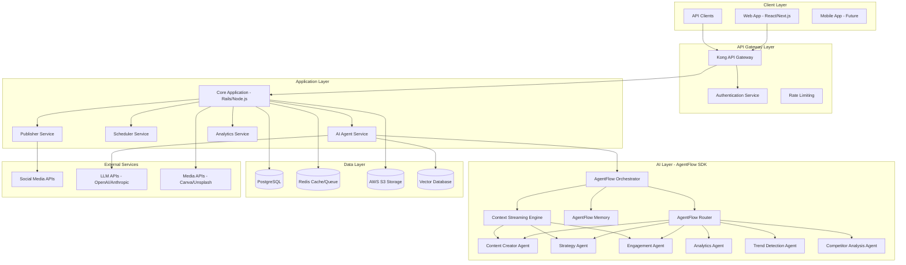
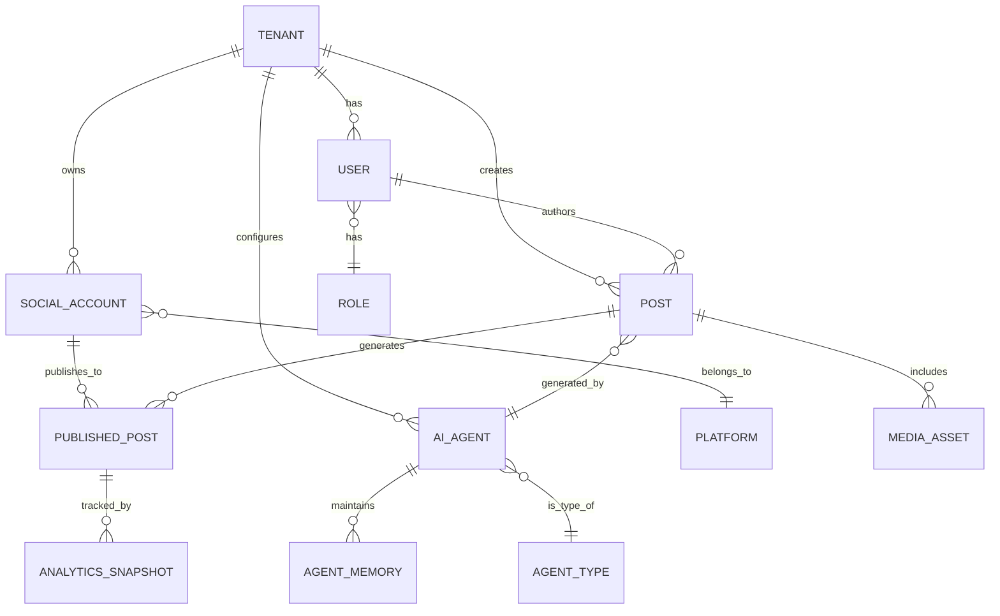

# Design Document

## Overview

The AI-powered social media management platform is designed as a scalable, multi-tenant SaaS application that leverages a multi-agent AI architecture to provide autonomous content creation, scheduling, and analytics across 9+ social media platforms. The system evolves from a monolithic MVP to a microservices architecture as it scales, with a focus on cost optimization and enterprise-grade security.

## Architecture

### High-Level System Architecture



### Multi-Tenant Architecture

The system implements row-level security (RLS) in PostgreSQL to ensure complete tenant isolation:

```sql
-- Enable RLS on all tenant-specific tables
ALTER TABLE posts ENABLE ROW LEVEL SECURITY;
ALTER TABLE social_accounts ENABLE ROW LEVEL SECURITY;
ALTER TABLE analytics_snapshots ENABLE ROW LEVEL SECURITY;

-- Create policies for tenant isolation
CREATE POLICY tenant_isolation ON posts
    USING (tenant_id = current_setting('app.current_tenant_id')::uuid);

CREATE POLICY tenant_isolation ON social_accounts
    USING (tenant_id = current_setting('app.current_tenant_id')::uuid);
```

## AgentFlow SDK - Novel AI Architecture

### Core Innovation: Dynamic Agent Composition

The AgentFlow SDK represents a novel approach to multi-agent AI systems, designed specifically for content generation and social media management. Unlike traditional frameworks that use static agent definitions, AgentFlow introduces several breakthrough concepts:

#### 1. Dynamic Agent Workflows

```typescript
// Example: Dynamic workflow composition for content creation
class ContentCreationWorkflow {
  async compose(request: ContentRequest): Promise<AgentWorkflow> {
    const workflow = new AgentWorkflow()
    
    // Dynamic agent selection based on content type and complexity
    if (request.contentType === 'video') {
      workflow.addAgent(new VideoScriptAgent())
      workflow.addAgent(new VideoGenerationAgent())
      workflow.addAgent(new ThumbnailAgent())
    } else if (request.complexity === 'high') {
      workflow.addAgent(new ResearchAgent())
      workflow.addAgent(new StrategyAgent())
      workflow.addAgent(new ContentCreatorAgent())
      workflow.addAgent(new ReviewAgent())
    } else {
      workflow.addAgent(new ContentCreatorAgent())
    }
    
    // Add platform-specific optimization agents
    for (const platform of request.platforms) {
      workflow.addAgent(new PlatformOptimizerAgent(platform))
    }
    
    return workflow
  }
}
```

#### 2. Context Streaming Architecture

Traditional multi-agent systems pass full context between agents, leading to exponential cost growth. AgentFlow introduces context streaming:

```typescript
class ContextStreamingEngine {
  // Stream only relevant context deltas between agents
  async streamContext(fromAgent: Agent, toAgent: Agent, task: Task): Promise<void> {
    const relevantContext = await this.extractRelevantContext(
      fromAgent.getContext(), 
      toAgent.getRequiredContext(task)
    )
    
    // Compress and stream only the delta
    const contextDelta = this.compressContext(relevantContext)
    await toAgent.receiveContextStream(contextDelta)
  }
  
  // Intelligent context relevance scoring
  private async extractRelevantContext(
    fullContext: Context, 
    requiredContext: ContextRequirements
  ): Promise<PartialContext> {
    const relevanceScores = await this.scoreContextRelevance(fullContext, requiredContext)
    return this.filterByRelevanceThreshold(fullContext, relevanceScores, 0.7)
  }
}
```

#### 3. Cost-Aware Model Routing

```typescript
class IntelligentModelRouter {
  async routeRequest(request: AIRequest, budget: Budget): Promise<RoutingDecision> {
    // Analyze request complexity
    const complexity = await this.analyzeComplexity(request)
    
    // Get available models within budget
    const availableModels = await this.getModelsWithinBudget(budget, complexity)
    
    // Select optimal model based on cost-quality ratio
    const optimalModel = await this.selectOptimalModel(availableModels, request)
    
    // Check if caching can reduce costs
    const cachedResult = await this.checkCache(request)
    if (cachedResult && cachedResult.confidence > 0.9) {
      return { useCache: true, result: cachedResult, cost: 0 }
    }
    
    return {
      model: optimalModel,
      estimatedCost: optimalModel.estimateCost(request),
      fallbackModels: availableModels.slice(1, 3)
    }
  }
  
  // Novel complexity analysis using multiple factors
  private async analyzeComplexity(request: AIRequest): Promise<ComplexityScore> {
    const factors = {
      tokenCount: request.prompt.length,
      taskType: this.getTaskComplexity(request.taskType),
      contextSize: request.context?.length || 0,
      outputRequirements: this.analyzeOutputComplexity(request.expectedOutput),
      realTimeRequirements: request.isRealTime ? 1.5 : 1.0
    }
    
    return this.calculateComplexityScore(factors)
  }
}
```

#### 4. Adaptive Learning System

```typescript
class AdaptiveLearningEngine {
  async learnFromExecution(
    workflowId: string, 
    result: WorkflowResult, 
    feedback: UserFeedback
  ): Promise<void> {
    // Analyze what worked well
    const successPatterns = await this.identifySuccessPatterns(result, feedback)
    
    // Update agent collaboration weights
    await this.updateCollaborationWeights(workflowId, successPatterns)
    
    // Optimize model selection for similar tasks
    await this.optimizeModelSelection(result.modelChoices, feedback.qualityScore)
    
    // Update cost optimization strategies
    await this.updateCostOptimization(result.actualCost, result.qualityScore)
  }
  
  // Learn optimal agent combinations
  private async updateCollaborationWeights(
    workflowId: string, 
    patterns: SuccessPattern[]
  ): Promise<void> {
    for (const pattern of patterns) {
      const agentCombination = pattern.agentCombination
      const successScore = pattern.successScore
      
      // Update collaboration matrix
      await this.collaborationMatrix.updateWeight(
        agentCombination, 
        successScore, 
        0.1 // learning rate
      )
    }
  }
}
```

#### 5. Real-Time Agent Coordination

```typescript
class RealTimeCoordinator {
  async coordinateAgents(
    agents: Agent[], 
    task: CollaborativeTask
  ): Promise<CollaborationResult> {
    // Create coordination channels
    const coordinationChannels = await this.createChannels(agents)
    
    // Start parallel execution with real-time coordination
    const executionPromises = agents.map(agent => 
      this.executeWithCoordination(agent, task, coordinationChannels)
    )
    
    // Monitor and coordinate in real-time
    const coordinator = this.startRealTimeCoordination(agents, coordinationChannels)
    
    // Wait for completion
    const results = await Promise.all(executionPromises)
    coordinator.stop()
    
    return this.synthesizeResults(results)
  }
  
  private async executeWithCoordination(
    agent: Agent, 
    task: CollaborativeTask, 
    channels: CoordinationChannels
  ): Promise<AgentResult> {
    return new Promise(async (resolve) => {
      // Listen for coordination messages
      channels.onMessage(agent.id, async (message) => {
        await agent.handleCoordinationMessage(message)
      })
      
      // Execute with periodic coordination checks
      const result = await agent.executeWithCoordination(task, channels)
      resolve(result)
    })
  }
}
```

### AgentFlow SDK Benefits

1. **Cost Optimization**: 60-80% reduction in AI costs through intelligent routing and context streaming
2. **Quality Improvement**: Adaptive learning improves output quality over time
3. **Scalability**: Dynamic composition allows handling of complex tasks without fixed overhead
4. **Flexibility**: Agents can be recombined for different use cases without code changes
5. **Real-Time Coordination**: Agents can collaborate in real-time for complex tasks

## Components and Interfaces

### Core Application Components

#### 1. Authentication & Authorization Service

**Responsibilities:**
- JWT token management with tenant_id claims
- OAuth 2.0 integration for social platform authentication
- Role-based access control (RBAC)
- API key management for public API access

**Key Interfaces:**
```typescript
interface AuthService {
  authenticate(credentials: LoginCredentials): Promise<AuthToken>
  refreshToken(token: string): Promise<AuthToken>
  validatePermission(userId: string, resource: string, action: string): Promise<boolean>
  revokeAccess(userId: string, tenantId: string): Promise<void>
}

interface SocialAuthService {
  initiateOAuth(platform: SocialPlatform, tenantId: string): Promise<OAuthUrl>
  handleCallback(code: string, state: string): Promise<SocialAccount>
  refreshSocialToken(accountId: string): Promise<TokenInfo>
}
```

#### 2. Content Management Service

**Responsibilities:**
- Post creation, editing, and versioning
- Media library management with S3 integration
- Content scheduling and queue management
- Cross-platform content adaptation

**Key Interfaces:**
```typescript
interface ContentService {
  createPost(content: PostContent, tenantId: string): Promise<Post>
  schedulePost(postId: string, scheduledTime: Date, platforms: Platform[]): Promise<ScheduledPost>
  adaptContentForPlatform(content: PostContent, platform: Platform): Promise<AdaptedContent>
  uploadMedia(file: File, tenantId: string): Promise<MediaAsset>
}

interface MediaLibrary {
  storeAsset(file: File, metadata: AssetMetadata): Promise<MediaAsset>
  optimizeForPlatform(assetId: string, platform: Platform): Promise<OptimizedAsset>
  generateThumbnail(videoId: string): Promise<ThumbnailAsset>
}
```

#### 3. AI Agent Orchestration Service (Novel Architecture)

**Responsibilities:**
- Coordinate multiple AI agents using custom-built AgentFlow SDK
- Route requests to appropriate AI models based on complexity and cost
- Manage AI cost optimization and intelligent caching
- Handle agent memory, context persistence, and cross-agent communication
- Implement novel agent collaboration patterns and workflows

**AgentFlow SDK - Core Architecture:**

The AgentFlow SDK is a custom-built, in-house framework that provides a novel approach to multi-agent AI coordination. Unlike existing frameworks, it focuses on:

1. **Dynamic Agent Composition**: Agents can be dynamically composed and reconfigured based on task requirements
2. **Intelligent Model Routing**: Automatic selection of the most cost-effective model for each subtask
3. **Context Streaming**: Real-time context sharing between agents without full context duplication
4. **Adaptive Learning**: Agents learn from user feedback and improve their collaboration patterns
5. **Cost-Aware Execution**: Every operation is optimized for cost while maintaining quality

**Key Interfaces:**
```typescript
// Core AgentFlow SDK interfaces
interface AgentFlowOrchestrator {
  // Dynamic agent composition
  composeAgentWorkflow(task: Task, constraints: ExecutionConstraints): Promise<AgentWorkflow>
  
  // Intelligent execution with cost optimization
  executeWorkflow(workflow: AgentWorkflow): Promise<WorkflowResult>
  
  // Real-time agent coordination
  coordinateAgents(agents: Agent[], sharedContext: Context): Promise<CollaborationResult>
  
  // Adaptive learning from outcomes
  learnFromExecution(workflowId: string, feedback: UserFeedback): Promise<void>
}

interface AgentFlowAgent {
  // Agent identity and capabilities
  id: string
  type: AgentType
  capabilities: AgentCapability[]
  costProfile: CostProfile
  
  // Core execution methods
  execute(task: AgentTask, context: ExecutionContext): Promise<AgentResult>
  
  // Context management
  shareContext(targetAgent: string, context: PartialContext): Promise<void>
  receiveContext(sourceAgent: string, context: PartialContext): Promise<void>
  
  // Learning and adaptation
  updateFromFeedback(feedback: AgentFeedback): Promise<void>
  
  // Cost optimization
  estimateCost(task: AgentTask): Promise<CostEstimate>
}

interface AgentFlowMemory {
  // Distributed memory system
  storeSharedMemory(key: string, value: any, ttl?: number): Promise<void>
  retrieveSharedMemory(key: string): Promise<any>
  
  // Agent-specific memory
  storeAgentMemory(agentId: string, memory: AgentMemory): Promise<void>
  retrieveAgentMemory(agentId: string, query: MemoryQuery): Promise<AgentMemory[]>
  
  // Context streaming
  streamContext(fromAgent: string, toAgent: string, context: StreamingContext): Promise<void>
  
  // Memory optimization
  compressMemory(agentId: string): Promise<void>
  cleanupExpiredMemory(): Promise<void>
}

interface AgentFlowRouter {
  // Intelligent model selection
  selectOptimalModel(task: Task, constraints: ModelConstraints): Promise<ModelSelection>
  
  // Cost-aware routing
  routeRequest(request: AIRequest, budget: Budget): Promise<RoutingDecision>
  
  // Load balancing
  balanceLoad(requests: AIRequest[]): Promise<LoadBalancedRequests>
  
  // Fallback handling
  handleModelFailure(failedModel: string, request: AIRequest): Promise<FallbackRoute>
}
```

#### 4. Publishing Service

**Responsibilities:**
- Execute scheduled posts across all platforms
- Handle platform-specific API requirements
- Implement retry logic with exponential backoff
- Track publishing success/failure rates

**Key Interfaces:**
```typescript
interface PublishingService {
  publishPost(post: ScheduledPost): Promise<PublishResult>
  retryFailedPost(postId: string): Promise<PublishResult>
  validatePostContent(content: PostContent, platform: Platform): Promise<ValidationResult>
  trackPublishingMetrics(): Promise<PublishingMetrics>
}

interface PlatformAdapter {
  authenticate(credentials: OAuthCredentials): Promise<PlatformSession>
  publishContent(content: AdaptedContent): Promise<PlatformPostId>
  fetchEngagementMetrics(postId: string): Promise<EngagementData>
}
```

#### 5. Analytics & Reporting Service

**Responsibilities:**
- Collect engagement metrics from all platforms
- Generate performance insights and recommendations
- Create custom reports and dashboards
- Track ROI and conversion metrics

**Key Interfaces:**
```typescript
interface AnalyticsService {
  collectMetrics(accountId: string, timeRange: TimeRange): Promise<MetricsData>
  generateInsights(metricsData: MetricsData): Promise<PerformanceInsights>
  createReport(reportConfig: ReportConfiguration): Promise<Report>
  trackConversions(utmParams: UTMParameters): Promise<ConversionData>
}

interface ReportGenerator {
  buildDashboard(widgets: DashboardWidget[]): Promise<Dashboard>
  exportReport(reportId: string, format: ExportFormat): Promise<ExportedReport>
  scheduleReport(reportConfig: ReportConfiguration, schedule: CronSchedule): Promise<ScheduledReport>
}
```

## Data Models

### Core Entity Relationships



### Database Schema Design

```sql
-- Tenants table with plan-based feature flags
CREATE TABLE tenants (
    id UUID PRIMARY KEY DEFAULT gen_random_uuid(),
    name VARCHAR(255) NOT NULL,
    plan_tier VARCHAR(50) NOT NULL CHECK (plan_tier IN ('free', 'starter', 'professional', 'business', 'enterprise')),
    billing_status VARCHAR(50) DEFAULT 'active',
    settings JSONB DEFAULT '{}',
    ai_budget_limit DECIMAL(10,2) DEFAULT 0.00,
    ai_usage_current DECIMAL(10,2) DEFAULT 0.00,
    created_at TIMESTAMP DEFAULT NOW(),
    updated_at TIMESTAMP DEFAULT NOW()
);

-- Enhanced social accounts with token management
CREATE TABLE social_accounts (
    id UUID PRIMARY KEY DEFAULT gen_random_uuid(),
    tenant_id UUID NOT NULL REFERENCES tenants(id) ON DELETE CASCADE,
    platform VARCHAR(50) NOT NULL,
    account_identifier VARCHAR(255) NOT NULL,
    display_name VARCHAR(255),
    oauth_tokens_encrypted TEXT NOT NULL,
    refresh_token_encrypted TEXT,
    token_expires_at TIMESTAMP,
    account_metadata JSONB DEFAULT '{}',
    status VARCHAR(50) DEFAULT 'active',
    last_sync_at TIMESTAMP,
    created_at TIMESTAMP DEFAULT NOW(),
    UNIQUE(tenant_id, platform, account_identifier)
);

-- Posts with AI generation tracking
CREATE TABLE posts (
    id UUID PRIMARY KEY DEFAULT gen_random_uuid(),
    tenant_id UUID NOT NULL REFERENCES tenants(id) ON DELETE CASCADE,
    user_id UUID REFERENCES users(id),
    content TEXT NOT NULL,
    media_urls TEXT[],
    scheduled_time TIMESTAMP,
    status VARCHAR(50) DEFAULT 'draft',
    ai_generated BOOLEAN DEFAULT FALSE,
    agent_id UUID REFERENCES ai_agents(id),
    parent_post_id UUID REFERENCES posts(id),
    platform_adaptations JSONB DEFAULT '{}',
    created_at TIMESTAMP DEFAULT NOW(),
    updated_at TIMESTAMP DEFAULT NOW()
);

-- AI agents configuration
CREATE TABLE ai_agents (
    id UUID PRIMARY KEY DEFAULT gen_random_uuid(),
    tenant_id UUID NOT NULL REFERENCES tenants(id) ON DELETE CASCADE,
    name VARCHAR(255) NOT NULL,
    type VARCHAR(50) NOT NULL CHECK (type IN ('content_creator', 'strategy', 'engagement', 'analytics', 'trend_detection', 'competitor_analysis')),
    personality_config JSONB DEFAULT '{}',
    model_name VARCHAR(100) DEFAULT 'gpt-4o-mini',
    active BOOLEAN DEFAULT TRUE,
    usage_stats JSONB DEFAULT '{}',
    created_at TIMESTAMP DEFAULT NOW()
);

-- Analytics with time-series optimization
CREATE TABLE analytics_snapshots (
    id UUID PRIMARY KEY DEFAULT gen_random_uuid(),
    post_id UUID REFERENCES posts(id) ON DELETE CASCADE,
    account_id UUID REFERENCES social_accounts(id) ON DELETE CASCADE,
    platform_post_id VARCHAR(255),
    snapshot_at TIMESTAMP NOT NULL,
    metrics JSONB NOT NULL,
    growth_rate DECIMAL(5,2),
    created_at TIMESTAMP DEFAULT NOW()
);

-- Partitioning for analytics performance
CREATE TABLE analytics_snapshots_y2024m01 PARTITION OF analytics_snapshots
    FOR VALUES FROM ('2024-01-01') TO ('2024-02-01');
```

## Error Handling

### Error Classification and Response Strategy

#### 1. Platform API Errors

**Instagram/Facebook Graph API:**
```typescript
class PlatformErrorHandler {
  async handleGraphAPIError(error: GraphAPIError): Promise<ErrorResponse> {
    switch (error.code) {
      case 190: // Invalid access token
        await this.refreshToken(error.accountId)
        return { retry: true, delay: 0 }
      
      case 368: // Temporarily blocked
        return { retry: true, delay: 3600000 } // 1 hour
      
      case 100: // Invalid parameter
        return { retry: false, userAction: 'fix_content' }
      
      default:
        return { retry: true, delay: this.exponentialBackoff(error.attemptCount) }
    }
  }
}
```

**Twitter/X API v2:**
```typescript
async handleTwitterError(error: TwitterAPIError): Promise<ErrorResponse> {
  if (error.status === 429) { // Rate limit
    const resetTime = error.headers['x-rate-limit-reset']
    return { retry: true, delay: (resetTime * 1000) - Date.now() }
  }
  
  if (error.status === 401) { // Unauthorized
    await this.refreshTwitterToken(error.accountId)
    return { retry: true, delay: 0 }
  }
  
  return { retry: false, userAction: 'check_content_policy' }
}
```

#### 2. AI Service Error Handling

**OpenAI/Anthropic API Errors:**
```typescript
class AIErrorHandler {
  async handleLLMError(error: LLMError, request: AIRequest): Promise<AIErrorResponse> {
    if (error.type === 'rate_limit_exceeded') {
      // Route to alternative model
      const alternativeModel = this.getAlternativeModel(request.model)
      return { retry: true, alternativeModel, delay: 60000 }
    }
    
    if (error.type === 'context_length_exceeded') {
      // Truncate context and retry
      const truncatedRequest = await this.truncateContext(request)
      return { retry: true, modifiedRequest: truncatedRequest }
    }
    
    if (error.type === 'content_policy_violation') {
      // Log for review and use fallback content
      await this.logPolicyViolation(request)
      return { retry: false, useFallback: true }
    }
    
    return { retry: true, delay: this.exponentialBackoff(error.attemptCount) }
  }
}
```

#### 3. System-Level Error Recovery

**Database Connection Failures:**
```typescript
class DatabaseErrorHandler {
  async handleConnectionError(error: DatabaseError): Promise<void> {
    if (error.code === 'ECONNREFUSED') {
      // Attempt reconnection with circuit breaker
      await this.circuitBreaker.execute(() => this.reconnectDatabase())
    }
    
    if (error.code === 'ENOTFOUND') {
      // DNS resolution issue - use backup connection string
      await this.switchToBackupDatabase()
    }
    
    // Log critical error and alert operations team
    await this.alertOpsTeam(error)
  }
}
```

## Testing Strategy

### 1. Unit Testing Framework

**AgentFlow SDK Testing:**
```typescript
describe('AgentFlowOrchestrator', () => {
  let orchestrator: AgentFlowOrchestrator
  let mockRouter: jest.Mocked<AgentFlowRouter>
  let mockMemory: jest.Mocked<AgentFlowMemory>
  
  beforeEach(() => {
    mockRouter = createMockRouter()
    mockMemory = createMockMemory()
    orchestrator = new AgentFlowOrchestrator(mockRouter, mockMemory)
  })
  
  it('should dynamically compose optimal agent workflow', async () => {
    const task = { 
      type: 'content_creation', 
      complexity: 'high',
      platforms: ['instagram', 'linkedin'],
      budget: { max: 0.50, currency: 'USD' }
    }
    
    const workflow = await orchestrator.composeAgentWorkflow(task, {
      maxCost: 0.50,
      maxDuration: 30000
    })
    
    expect(workflow.agents).toHaveLength(4) // Research, Strategy, Content, Platform optimizers
    expect(workflow.estimatedCost).toBeLessThan(0.50)
    expect(workflow.agents.some(a => a.type === 'research')).toBe(true)
    expect(workflow.agents.some(a => a.type === 'platform_optimizer')).toBe(true)
  })
  
  it('should optimize costs through intelligent model routing', async () => {
    const request = { 
      prompt: 'Simple caption for coffee shop',
      complexity: 'low',
      budget: { max: 0.10 }
    }
    
    mockRouter.selectOptimalModel.mockResolvedValue({
      model: 'gpt-4o-mini',
      estimatedCost: 0.002,
      confidence: 0.95
    })
    
    const result = await orchestrator.executeWorkflow(createSimpleWorkflow(request))
    
    expect(result.actualCost).toBeLessThan(0.05)
    expect(mockRouter.selectOptimalModel).toHaveBeenCalledWith(
      expect.objectContaining({ complexity: 'low' }),
      expect.objectContaining({ max: 0.10 })
    )
  })
  
  it('should stream context efficiently between agents', async () => {
    const agents = [
      new ResearchAgent(),
      new ContentCreatorAgent(),
      new PlatformOptimizerAgent('instagram')
    ]
    
    const task = { topic: 'sustainable fashion trends' }
    
    const result = await orchestrator.coordinateAgents(agents, task)
    
    // Verify context streaming was used (not full context passing)
    expect(mockMemory.streamContext).toHaveBeenCalledTimes(2)
    expect(mockMemory.storeSharedMemory).toHaveBeenCalledWith(
      expect.stringContaining('context_stream'),
      expect.any(Object),
      300 // 5 minute TTL
    )
  })
})

describe('AdaptiveLearningEngine', () => {
  it('should improve agent selection based on feedback', async () => {
    const learningEngine = new AdaptiveLearningEngine()
    
    // Simulate multiple executions with feedback
    const executions = [
      { 
        workflow: 'research+content+optimize',
        result: { qualityScore: 0.9, cost: 0.15 },
        feedback: { userRating: 5, engagement: 'high' }
      },
      {
        workflow: 'content+optimize',
        result: { qualityScore: 0.7, cost: 0.08 },
        feedback: { userRating: 3, engagement: 'medium' }
      }
    ]
    
    for (const exec of executions) {
      await learningEngine.learnFromExecution(
        exec.workflow,
        exec.result,
        exec.feedback
      )
    }
    
    // Verify learning improved recommendations
    const recommendation = await learningEngine.recommendWorkflow({
      taskType: 'content_creation',
      qualityTarget: 0.8
    })
    
    expect(recommendation.workflow).toContain('research')
    expect(recommendation.confidence).toBeGreaterThan(0.8)
  })
})
```

**Publishing Service Testing:**
```typescript
describe('PublishingService', () => {
  it('should retry failed posts with exponential backoff', async () => {
    const mockPlatformAdapter = createMockPlatformAdapter()
    mockPlatformAdapter.publishContent
      .mockRejectedValueOnce(new Error('Temporary failure'))
      .mockResolvedValueOnce({ postId: '123' })
    
    const service = new PublishingService(mockPlatformAdapter)
    const result = await service.publishPost(mockPost)
    
    expect(result.success).toBe(true)
    expect(mockPlatformAdapter.publishContent).toHaveBeenCalledTimes(2)
  })
})
```

### 2. Integration Testing

**End-to-End Content Flow:**
```typescript
describe('Content Publishing Flow', () => {
  it('should create, schedule, and publish content successfully', async () => {
    // Create content with AI
    const contentRequest = {
      prompt: 'Write about sustainable fashion',
      platforms: ['instagram', 'twitter'],
      tenantId: 'test-tenant'
    }
    
    const generatedContent = await aiService.generateContent(contentRequest)
    expect(generatedContent).toBeDefined()
    
    // Schedule the content
    const scheduledPost = await contentService.schedulePost({
      content: generatedContent,
      scheduledTime: new Date(Date.now() + 3600000), // 1 hour from now
      platforms: ['instagram', 'twitter']
    })
    
    // Simulate scheduler execution
    await schedulerService.processScheduledPosts()
    
    // Verify publication
    const publishedPosts = await publishingService.getPublishedPosts(scheduledPost.id)
    expect(publishedPosts).toHaveLength(2) // Instagram + Twitter
    expect(publishedPosts.every(p => p.status === 'published')).toBe(true)
  })
})
```

### 3. Performance Testing

**Load Testing Configuration:**
```typescript
// k6 load testing script
import http from 'k6/http'
import { check } from 'k6'

export let options = {
  stages: [
    { duration: '2m', target: 100 }, // Ramp up
    { duration: '5m', target: 100 }, // Stay at 100 users
    { duration: '2m', target: 200 }, // Ramp up to 200
    { duration: '5m', target: 200 }, // Stay at 200
    { duration: '2m', target: 0 },   // Ramp down
  ],
  thresholds: {
    http_req_duration: ['p(95)<200'], // 95% of requests under 200ms
    http_req_failed: ['rate<0.01'],   // Error rate under 1%
  }
}

export default function() {
  const response = http.post('https://api.platform.com/v1/posts', {
    content: 'Test post content',
    platforms: ['instagram', 'twitter']
  }, {
    headers: { 'Authorization': 'Bearer test-token' }
  })
  
  check(response, {
    'status is 201': (r) => r.status === 201,
    'response time < 200ms': (r) => r.timings.duration < 200,
  })
}
```

### 4. AI Model Testing

**Model Performance Validation:**
```typescript
describe('AI Model Performance', () => {
  it('should maintain content quality across different models', async () => {
    const testPrompts = [
      'Write a professional LinkedIn post about AI trends',
      'Create an engaging Instagram caption for a coffee shop',
      'Draft a Twitter thread about productivity tips'
    ]
    
    const models = ['gpt-4o-mini', 'gpt-4o', 'claude-3.5-sonnet']
    
    for (const prompt of testPrompts) {
      for (const model of models) {
        const content = await aiService.generateContent({ prompt, model })
        
        // Quality checks
        expect(content.text.length).toBeGreaterThan(10)
        expect(content.text.length).toBeLessThan(2000)
        expect(content.sentiment).toBeGreaterThan(0.3) // Positive sentiment
        
        // Platform compliance
        if (prompt.includes('Twitter')) {
          expect(content.text.length).toBeLessThan(280)
        }
      }
    }
  })
})
```

### 5. Security Testing

**Authentication & Authorization:**
```typescript
describe('Security Tests', () => {
  it('should prevent cross-tenant data access', async () => {
    const tenant1Token = await authService.authenticate(tenant1Credentials)
    const tenant2Token = await authService.authenticate(tenant2Credentials)
    
    // Try to access tenant2 data with tenant1 token
    const response = await request(app)
      .get('/api/v1/posts')
      .set('Authorization', `Bearer ${tenant1Token}`)
      .query({ tenantId: 'tenant2-id' })
    
    expect(response.status).toBe(403)
    expect(response.body.posts).toBeUndefined()
  })
  
  it('should encrypt sensitive data at rest', async () => {
    const socialAccount = await socialAccountService.create({
      platform: 'instagram',
      accessToken: 'sensitive-token',
      tenantId: 'test-tenant'
    })
    
    // Verify token is encrypted in database
    const rawRecord = await db.query(
      'SELECT oauth_tokens_encrypted FROM social_accounts WHERE id = $1',
      [socialAccount.id]
    )
    
    expect(rawRecord.oauth_tokens_encrypted).not.toContain('sensitive-token')
    expect(rawRecord.oauth_tokens_encrypted).toMatch(/^[a-f0-9]+$/) // Hex encrypted
  })
})
```

This design provides a comprehensive foundation for building the AI-powered social media management platform with proper separation of concerns, scalable architecture, robust error handling, and thorough testing strategies.