# Competitive Benchmarking Architecture

## System Architecture Diagram

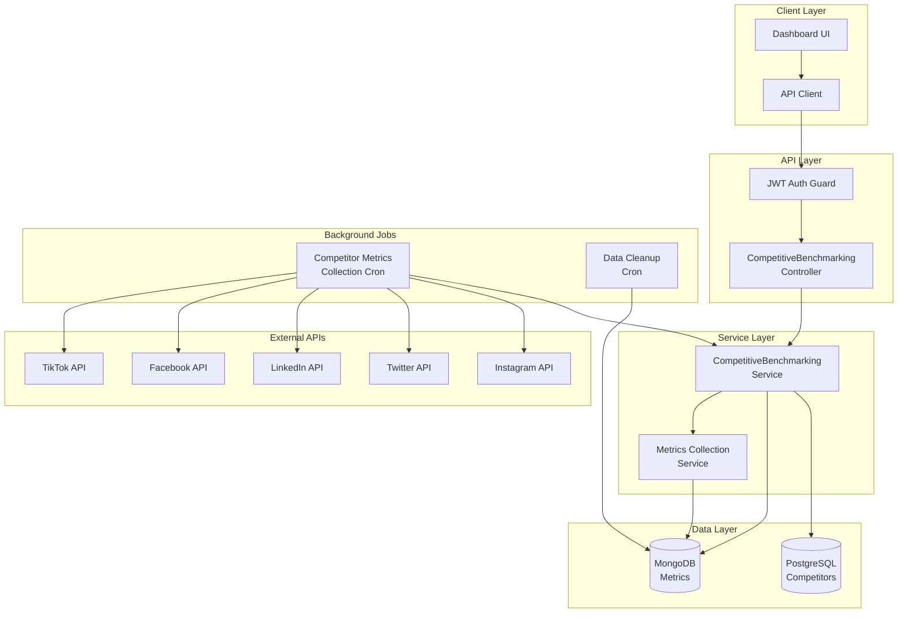

## Data Flow Diagrams

### 1. Competitor Creation Flow

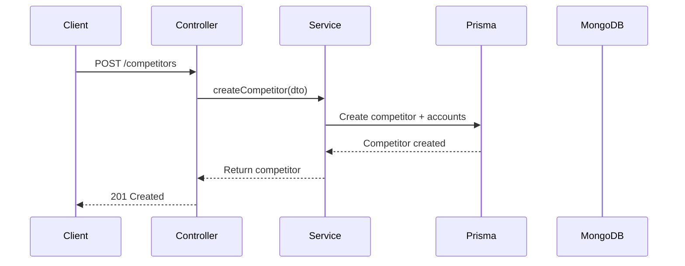

### 2. Metrics Collection Flow

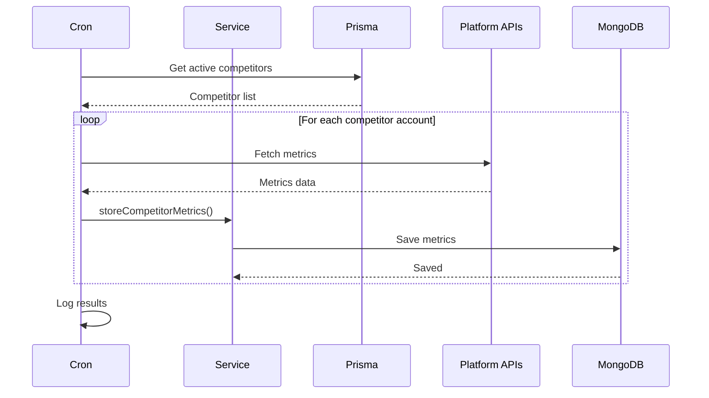

### 3. Competitive Benchmark Flow

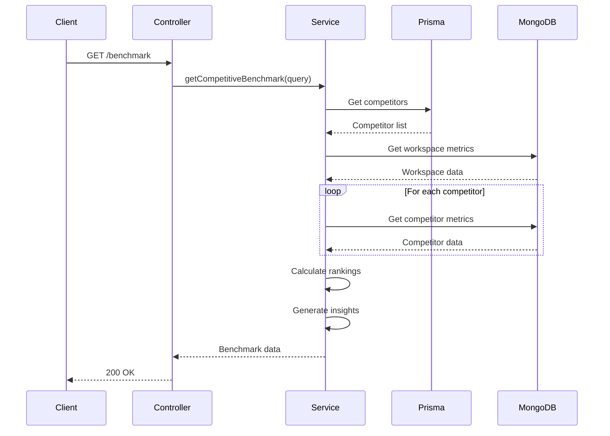

### 4. Share of Voice Flow

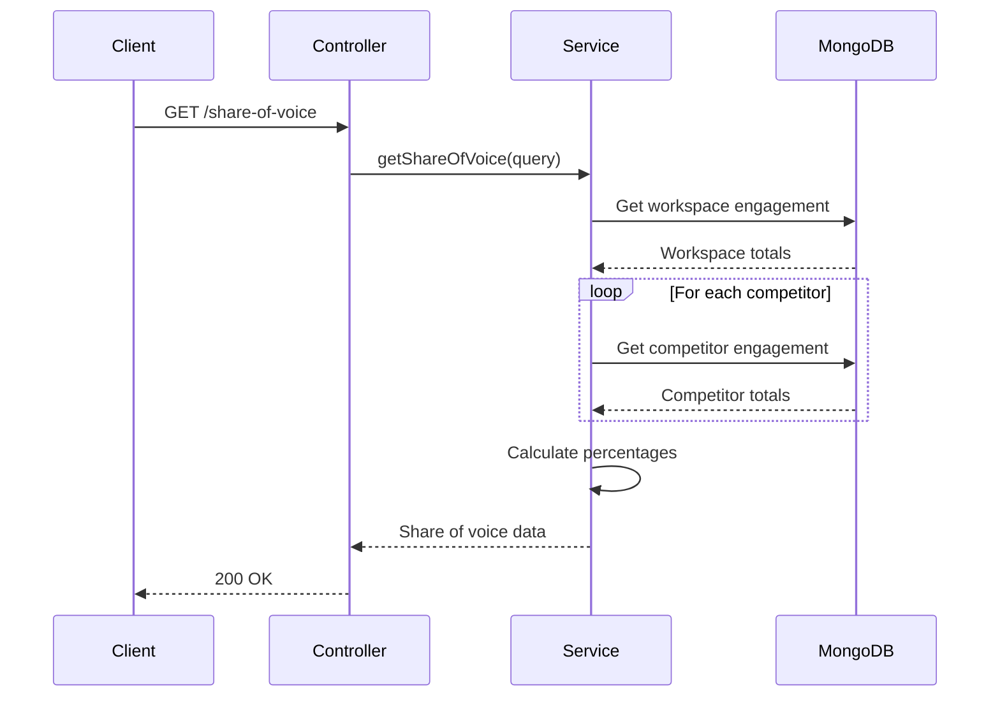

## Database Schema

### PostgreSQL (Prisma)

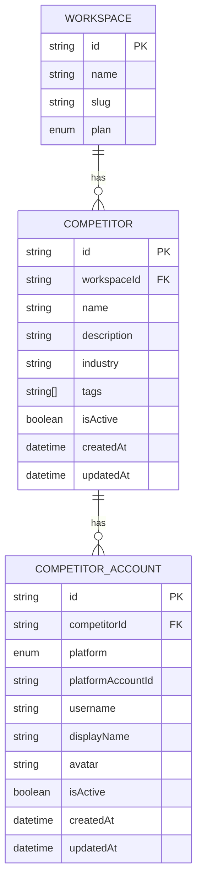

### MongoDB Collections

```javascript
// competitor_metrics collection
{
  _id: ObjectId,
  workspaceId: String,
  competitorId: String,
  competitorAccountId: String,
  platform: String,
  timestamp: Date,
  
  // Follower metrics
  followers: Number,
  following: Number,
  
  // Engagement metrics
  totalPosts: Number,
  totalLikes: Number,
  totalComments: Number,
  totalShares: Number,
  totalViews: Number,
  totalSaves: Number,
  
  // Calculated metrics
  engagementRate: Number,
  averageLikesPerPost: Number,
  averageCommentsPerPost: Number,
  postingFrequency: Number,
  
  // Content analysis
  contentTypes: {
    image: Number,
    video: Number,
    carousel: Number,
    text: Number
  },
  topHashtags: [String],
  topMentions: [String],
  
  // Metadata
  metadata: Object
}
```

## Component Interactions

### Service Dependencies

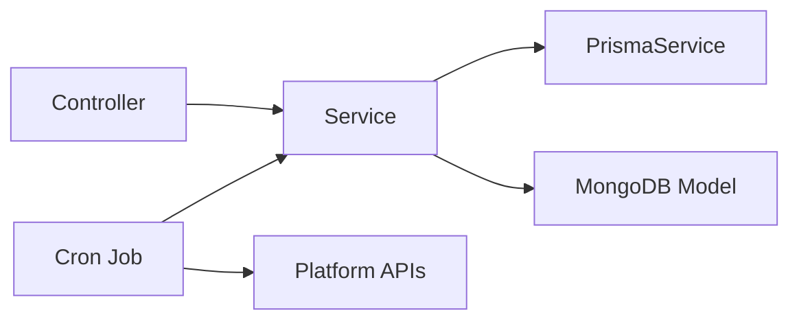

### Module Structure

```
analytics/
├── controllers/
│   └── competitive-benchmarking.controller.ts
├── services/
│   └── competitive-benchmarking.service.ts
├── cron/
│   └── competitor-metrics-collection.cron.ts
├── dto/
│   └── competitive-benchmarking.dto.ts
├── schemas/
│   └── competitor-metric.schema.ts
└── analytics.module.ts
```

## API Endpoint Structure

```
/api/analytics/competitive/
├── competitors/
│   ├── POST    /              (Create)
│   ├── GET     /              (List)
│   ├── GET     /:id           (Get)
│   ├── PUT     /:id           (Update)
│   └── DELETE  /:id           (Delete)
├── benchmark                  (Competitive comparison)
├── share-of-voice            (Share of voice analysis)
├── industry-benchmarks       (Industry comparison)
└── activity                  (Activity monitoring)
```

## Cron Job Schedule

```
Metrics Collection:
┌─────────────── minute (0)
│ ┌───────────── hour (*/6 = every 6 hours)
│ │ ┌─────────── day of month (*)
│ │ │ ┌───────── month (*)
│ │ │ │ ┌─────── day of week (*)
│ │ │ │ │
0 */6 * * *

Data Cleanup:
┌─────────────── minute (0)
│ ┌───────────── hour (2 = 2 AM)
│ │ ┌─────────── day of month (*)
│ │ │ ┌───────── month (*)
│ │ │ │ ┌─────── day of week (*)
│ │ │ │ │
0 2 * * *
```

## Performance Considerations

### Caching Strategy

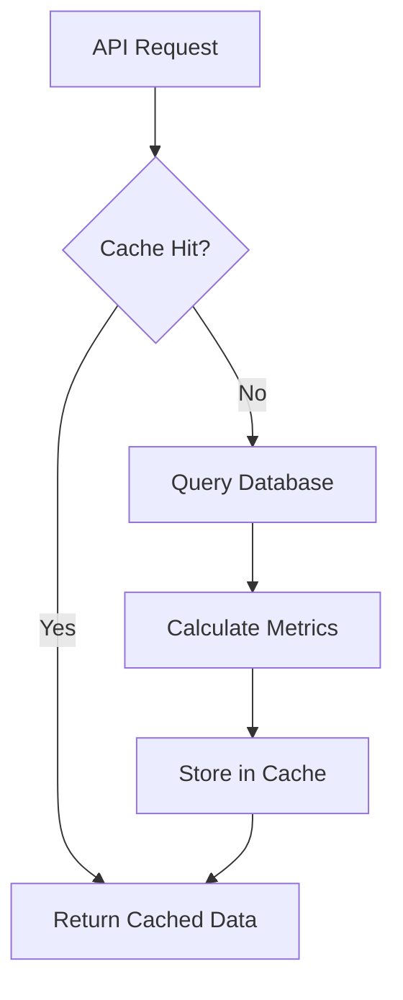

**Cache TTLs:**
- Competitor metrics: 6 hours
- Industry benchmarks: 24 hours
- Share of voice: 1 hour
- Rankings: 5 minutes

### Database Indexes

**MongoDB:**
```javascript
// Compound indexes for efficient queries
{ workspaceId: 1, timestamp: -1 }
{ competitorId: 1, timestamp: -1 }
{ competitorAccountId: 1, timestamp: -1 }
{ workspaceId: 1, platform: 1, timestamp: -1 }
```

**PostgreSQL:**
```sql
-- Indexes on competitors table
CREATE INDEX idx_competitors_workspace ON competitors(workspaceId);
CREATE INDEX idx_competitors_active ON competitors(isActive);

-- Indexes on competitor_accounts table
CREATE INDEX idx_competitor_accounts_competitor ON competitor_accounts(competitorId);
CREATE UNIQUE INDEX idx_competitor_accounts_unique 
  ON competitor_accounts(competitorId, platform, platformAccountId);
```

## Security Architecture

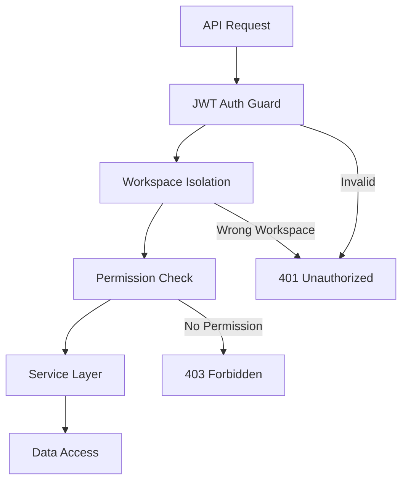

## Scalability Strategy

### Horizontal Scaling

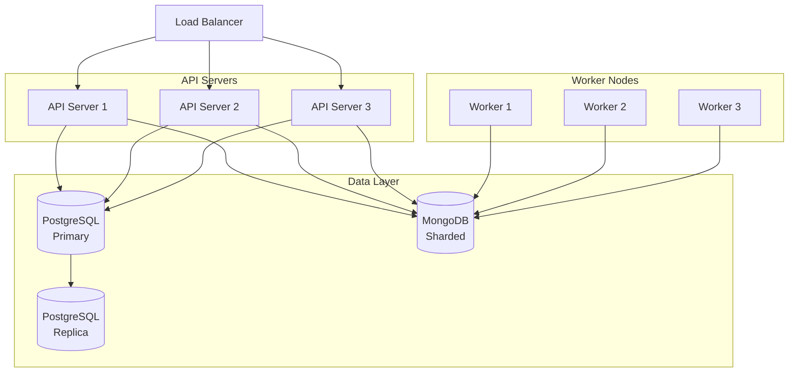

### Data Partitioning

**MongoDB Sharding Strategy:**
- Shard key: `{ workspaceId: 1, timestamp: 1 }`
- Enables horizontal scaling
- Efficient time-series queries
- Workspace isolation

## Monitoring and Observability

### Key Metrics to Track

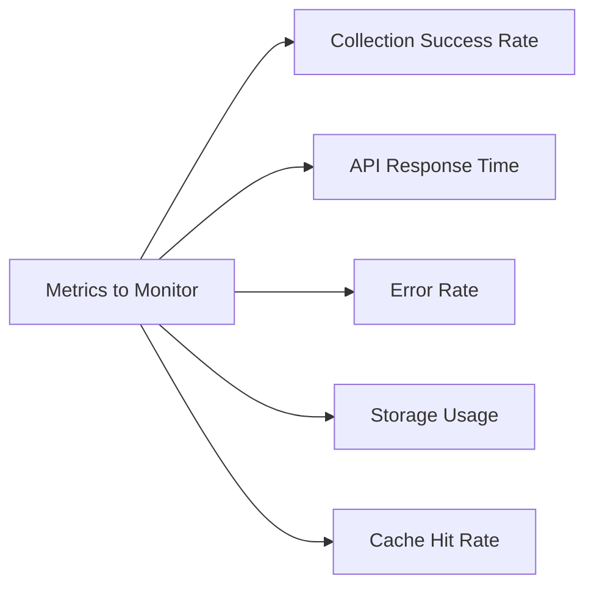

### Alert Thresholds

- Collection failure rate > 10%
- API response time > 2 seconds (p95)
- Error rate > 5%
- Storage usage > 80%
- Cache hit rate < 70%

## Future Architecture Enhancements

1. **Event-Driven Architecture**: Implement event bus for real-time updates
2. **GraphQL API**: Add GraphQL support for flexible queries
3. **Real-time WebSocket**: Push updates to connected clients
4. **ML Pipeline**: Integrate machine learning for predictive analytics
5. **Data Warehouse**: Export to BigQuery/Snowflake for advanced analytics
