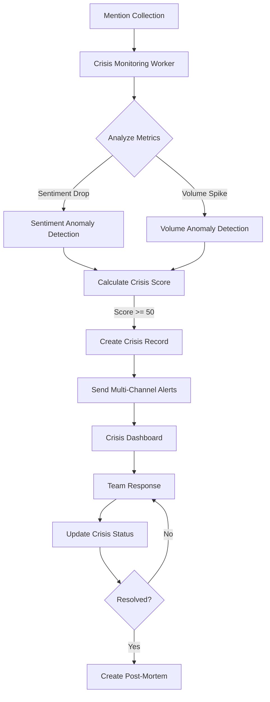

# Crisis Detection and Management System

## Overview

The Crisis Detection system provides real-time monitoring, alerting, and management capabilities for PR crises. It analyzes social media mentions to detect sentiment spikes, volume anomalies, and negative trends that could indicate a potential crisis.

**Requirements:** 9.5, 35.1, 35.2, 35.3, 35.4, 35.5

## Features

### 1. Automated Crisis Detection

- **Sentiment Spike Detection**: Identifies sudden drops in sentiment scores
- **Volume Anomaly Detection**: Detects unusual increases in mention volume
- **Crisis Scoring**: Calculates crisis severity (0-100) based on multiple factors
- **Configurable Thresholds**: Customizable detection sensitivity per workspace

### 2. Multi-Channel Alerting

Supports immediate alerts via:
- **Email**: Detailed crisis reports
- **SMS**: Urgent text notifications
- **Push Notifications**: Mobile app alerts
- **Slack**: Team channel notifications
- **Webhooks**: Custom integrations

### 3. Crisis Response Dashboard

Real-time monitoring interface providing:
- Active crisis list with severity indicators
- Sentiment tracking and trends
- Mention volume visualization
- Response coordination tools
- Team assignment and collaboration

### 4. Crisis Management Workflow

- **Detection**: Automatic identification of potential crises
- **Acknowledgment**: Team acknowledges and begins assessment
- **Response**: Coordinated response actions and communications
- **Resolution**: Crisis resolved and marked complete
- **Post-Mortem**: Analysis and lessons learned documentation

### 5. Historical Analysis

- Complete crisis history tracking
- Post-mortem documentation
- Response effectiveness metrics
- Lessons learned repository
- Preventive measures tracking

## Architecture

### Components

```
Crisis Detection System
├── CrisisDetectionService (Core Logic)
│   ├── Sentiment Spike Detection
│   ├── Volume Anomaly Detection
│   ├── Crisis Scoring Algorithm
│   ├── Alert Management
│   └── Post-Mortem Analysis
├── CrisisDetectionController (API Endpoints)
├── CrisisMonitoringWorker (Automated Monitoring)
├── Crisis Schema (MongoDB)
└── DTOs (Request/Response Models)
```

### Data Flow



## Crisis Detection Algorithm

### Sentiment Spike Detection

Identifies sudden drops in sentiment:

```typescript
// Sentiment anomaly criteria
- Current sentiment < threshold (default: -0.5)
- Sentiment change < -0.2 from baseline
- Severity based on magnitude:
  - CRITICAL: sentiment < -0.7 or change < -0.5
  - HIGH: sentiment < -0.5 or change < -0.3
  - MEDIUM: sentiment < -0.3 or change < -0.2
  - LOW: other cases
```

### Volume Anomaly Detection

Identifies unusual mention volume increases:

```typescript
// Volume anomaly criteria
- Volume change >= threshold (default: 200%)
- Severity based on magnitude:
  - CRITICAL: change >= 500%
  - HIGH: change >= 300%
  - MEDIUM: change >= 200%
  - LOW: other cases
```

### Crisis Scoring (0-100)

Combines multiple factors:

```typescript
Crisis Score = 
  Sentiment Factor (0-30) +
  Sentiment Change Factor (0-20) +
  Volume Factor (0-20) +
  Negative Percentage Factor (0-15) +
  Influencer Factor (0-10) +
  Volume Magnitude Factor (0-5)

// Crisis triggered when:
- (Sentiment OR Volume anomaly detected) AND
- Crisis Score >= 50
```

## API Endpoints

### Monitor for Crisis

```http
POST /api/listening/crisis/monitor
Authorization: Bearer <token>
Content-Type: application/json

{
  "sentimentThreshold": -0.5,
  "volumeThreshold": 200,
  "timeWindow": 60,
  "minMentions": 10,
  "platforms": ["TWITTER", "FACEBOOK"]
}
```

**Response:**
```json
{
  "crisisDetected": true,
  "crisis": {
    "id": "crisis_id",
    "title": "CRITICAL: Sentiment Spike - product, issue, complaint",
    "severity": "critical",
    "crisisScore": 85,
    "status": "detected"
  },
  "metrics": {
    "sentimentScore": -0.72,
    "sentimentChange": -0.45,
    "volumeChange": 350,
    "crisisScore": 85
  }
}
```

### Get Crisis Dashboard

```http
GET /api/listening/crisis/dashboard?status=detected,acknowledged&severity=high,critical
Authorization: Bearer <token>
```

**Response:**
```json
{
  "activeCrises": [
    {
      "id": "crisis_id",
      "title": "CRITICAL: Sentiment Spike",
      "severity": "critical",
      "status": "acknowledged",
      "crisisScore": 85,
      "detectedAt": "2024-01-15T10:30:00Z",
      "mentionVolume": 450,
      "sentimentScore": -0.72
    }
  ],
  "statistics": {
    "totalCrises": 12,
    "activeCrises": 2,
    "resolvedCrises": 10,
    "averageResponseTime": 15,
    "averageResolutionTime": 180,
    "criticalCrises": 3
  },
  "trends": {
    "crisisFrequency": [
      { "date": "2024-01-15", "count": 2 }
    ],
    "severityDistribution": {
      "low": 3,
      "medium": 5,
      "high": 3,
      "critical": 1
    }
  }
}
```

### Send Crisis Alerts

```http
POST /api/listening/crisis/:id/alerts
Authorization: Bearer <token>
Content-Type: application/json

{
  "channels": ["email", "sms", "slack"],
  "recipients": ["user_id_1", "user_id_2"],
  "customMessage": "Urgent: Customer complaints spiking on Twitter"
}
```

### Update Crisis Status

```http
PUT /api/listening/crisis/:id/status
Authorization: Bearer <token>
Content-Type: application/json

{
  "status": "acknowledged",
  "notes": "Team assembled, investigating root cause"
}
```

### Add Crisis Response

```http
POST /api/listening/crisis/:id/responses
Authorization: Bearer <token>
Content-Type: application/json

{
  "action": "Posted official statement",
  "content": "We are aware of the issue and working on a fix...",
  "platform": "TWITTER"
}
```

### Create Post-Mortem

```http
POST /api/listening/crisis/:id/post-mortem
Authorization: Bearer <token>
Content-Type: application/json

{
  "rootCause": "Server outage caused by database migration",
  "responseEffectiveness": 85,
  "lessonsLearned": [
    "Need better migration testing",
    "Improve communication during outages"
  ],
  "preventiveMeasures": [
    "Implement staging environment testing",
    "Create incident response playbook"
  ]
}
```

## Automated Monitoring

The `CrisisMonitoringWorker` runs automated checks:

### Every 5 Minutes
- Monitors all active workspaces for potential crises
- Analyzes recent mentions for anomalies
- Automatically sends alerts when crises detected

### Every 10 Minutes
- Updates metrics for active crises
- Tracks crisis evolution over time

### Daily at 2 AM
- Archives old resolved crises (90+ days)
- Cleans up historical data

## Configuration

### Workspace Settings

Configure crisis detection per workspace:

```json
{
  "crisisDetection": {
    "sentimentThreshold": -0.5,
    "volumeThreshold": 200,
    "timeWindow": 60,
    "minMentions": 10,
    "autoAlerts": true
  },
  "crisisAlerts": {
    "channels": ["email", "push", "slack"],
    "slackWebhook": "https://hooks.slack.com/...",
    "smsEnabled": true
  }
}
```

## Crisis Types

The system classifies crises into types:

- **SENTIMENT_SPIKE**: Sudden negative sentiment increase
- **VOLUME_ANOMALY**: Unusual mention volume surge
- **NEGATIVE_TREND**: Sustained negative sentiment
- **INFLUENCER_BACKLASH**: Negative influencer involvement
- **VIRAL_NEGATIVE**: Viral negative content
- **PRODUCT_ISSUE**: Product-related complaints
- **SERVICE_OUTAGE**: Service availability issues
- **PR_INCIDENT**: Public relations incident
- **SECURITY_BREACH**: Security-related crisis
- **OTHER**: Unclassified crisis

## Crisis Severity Levels

- **LOW**: Minor issue, low impact
- **MEDIUM**: Moderate issue, requires attention
- **HIGH**: Serious issue, immediate action needed
- **CRITICAL**: Severe crisis, urgent response required

## Crisis Status Workflow

1. **DETECTED**: Crisis automatically identified
2. **ACKNOWLEDGED**: Team has acknowledged and is assessing
3. **RESPONDING**: Active response in progress
4. **RESOLVED**: Crisis resolved and closed
5. **FALSE_ALARM**: Determined to be false positive

## Best Practices

### Detection Configuration

1. **Adjust Thresholds**: Tune based on your brand's normal activity
2. **Platform-Specific**: Different platforms may need different thresholds
3. **Time Windows**: Shorter windows (30-60 min) for fast-moving crises
4. **Minimum Mentions**: Set high enough to avoid false positives

### Alert Management

1. **Channel Selection**: Use SMS/push for critical alerts only
2. **Recipient Lists**: Maintain updated crisis response team lists
3. **Escalation**: Configure automatic escalation for unacknowledged crises
4. **Testing**: Regularly test alert channels

### Response Coordination

1. **Quick Acknowledgment**: Acknowledge crises within 5 minutes
2. **Team Assignment**: Assign specific team members immediately
3. **Response Tracking**: Document all actions taken
4. **Communication**: Keep stakeholders informed

### Post-Mortem Analysis

1. **Timely Creation**: Complete within 48 hours of resolution
2. **Honest Assessment**: Identify what worked and what didn't
3. **Actionable Measures**: Define specific preventive actions
4. **Knowledge Sharing**: Share learnings across organization

## Integration Examples

### Slack Integration

```typescript
// Configure Slack webhook in workspace settings
const slackWebhook = 'https://hooks.slack.com/services/YOUR/WEBHOOK/URL';

// Alerts automatically sent to Slack channel
// Customize message format in CrisisDetectionService
```

### Custom Webhook

```typescript
// Configure webhook URL in workspace settings
const webhookUrl = 'https://your-system.com/crisis-webhook';

// Webhook payload:
{
  "event": "crisis_detected",
  "crisis": {
    "id": "crisis_id",
    "title": "Crisis Title",
    "severity": "critical",
    "score": 85
  },
  "workspace": {
    "id": "workspace_id",
    "name": "Workspace Name"
  }
}
```

## Monitoring and Metrics

### Key Metrics

- **Detection Accuracy**: True positives vs false positives
- **Response Time**: Time from detection to acknowledgment
- **Resolution Time**: Time from detection to resolution
- **Alert Delivery**: Success rate of alert delivery
- **Team Performance**: Response effectiveness scores

### Dashboard Widgets

- Active crisis count
- Crisis severity distribution
- Response time trends
- Resolution time trends
- Crisis frequency over time
- Top crisis types
- Platform breakdown

## Troubleshooting

### False Positives

**Problem**: Too many false crisis alerts

**Solutions**:
- Increase `sentimentThreshold` (e.g., -0.6 instead of -0.5)
- Increase `volumeThreshold` (e.g., 300% instead of 200%)
- Increase `minMentions` (e.g., 20 instead of 10)
- Adjust `timeWindow` (e.g., 90 minutes instead of 60)

### Missed Crises

**Problem**: Real crises not detected

**Solutions**:
- Decrease thresholds for more sensitivity
- Reduce `timeWindow` for faster detection
- Check mention collection is working properly
- Verify sentiment analysis accuracy

### Alert Delivery Issues

**Problem**: Alerts not being received

**Solutions**:
- Verify channel configurations (email, SMS, Slack)
- Check recipient lists are up to date
- Test individual alert channels
- Review alert delivery logs

## Future Enhancements

- Machine learning-based crisis prediction
- Automated response suggestions
- Integration with customer support systems
- Advanced sentiment analysis with emotion detection
- Competitive crisis monitoring
- Industry-specific crisis templates
- Mobile app for crisis management
- Real-time collaboration features

## Support

For issues or questions:
- Check logs: `src/listening/services/crisis-detection.service.ts`
- Review worker logs: `src/listening/workers/crisis-monitoring.worker.ts`
- Contact: support@platform.com
